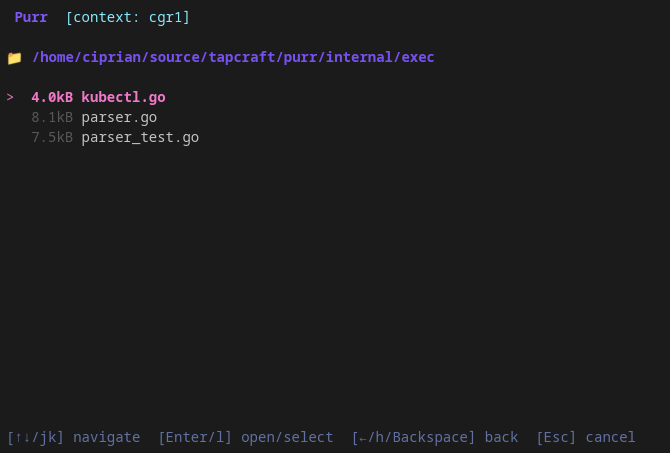

# Purr 🐱

[](https://golang.org)
[](https://github.com/tapcraft-io/purr)
[](LICENSE)

A beautiful TUI (Text User Interface) wrapper for kubectl that maintains 100% feature parity while adding quality-of-life improvements through intelligent completion, resource caching, and elegant design.


## Features

✨ **100% kubectl Compatible** - Every kubectl command works identically  
🚀 **Smart Completions** - Interactive suggestions for commands, resources, and namespaces  
💾 **Real-time Caching** - Watch-based updates with 5-minute fallback refresh  
📜 **Command History** - Persistent history with fuzzy search (Ctrl+R)  
🎨 **Beautiful UI** - Elegant design with Charm's Bubble Tea & Lipgloss  
⚡ **Shell Commands** - Run any shell command directly (non-kubectl commands execute as shell)  
📁 **File Picker** - Type `@` to browse and select files  
🔒 **Safety First** - Confirmation dialogs for destructive operations  
🎮 **Demo Mode** - Try without a cluster using `--demo`

## Installation

### From Releases

Download the latest binary for your platform from the [Releases page](https://github.com/tapcraft-io/purr/releases).

```bash
# Linux (amd64)
curl -LO https://github.com/tapcraft-io/purr/releases/latest/download/purr-linux-amd64.tar.gz
tar -xzf purr-linux-amd64.tar.gz
sudo mv purr-linux-amd64 /usr/local/bin/purr

# macOS (Apple Silicon)
curl -LO https://github.com/tapcraft-io/purr/releases/latest/download/purr-darwin-arm64.tar.gz
tar -xzf purr-darwin-arm64.tar.gz
sudo mv purr-darwin-arm64 /usr/local/bin/purr

# Windows - download the .zip from releases and add to PATH
```

### From Source

```bash
git clone https://github.com/tapcraft-io/purr.git
cd purr
go build -o purr cmd/purr/main.go
sudo mv purr /usr/local/bin/
```

### Using Go Install

```bash
go install github.com/tapcraft-io/purr/cmd/purr@latest
```

## Quick Start

Simply run `purr` in your terminal:

```bash
purr
```

Purr will use your existing kubectl configuration and context.

### Demo Mode

Try Purr without a Kubernetes cluster:

```bash
purr --demo
```

### Check Version

```bash
purr --version
```

## Demo

### Main Interface
Type any kubectl command and enjoy enhanced autocomplete:


### Resource Picker
Press `Tab` after typing a resource type to browse available resources:


### Command History (Ctrl+R)
Search through your command history with fuzzy matching:


### Easy file picker
Just use @ to reference any file in the working directory



## Usage

### Basic Commands

Just type kubectl commands as you normally would:

```
> kubectl get pods
> kubectl get pods -n production
> kubectl describe pod my-pod
> kubectl logs my-pod -f
> kubectl apply -f deployment.yaml
```

### Smart Features

#### Autocomplete Suggestions

Suggestions appear as you type. Use `↑/↓` or `Ctrl+N/Ctrl+P` to cycle through them, then `Tab` to accept:

```
> kubectl get [suggestions appear automatically]
```

#### Namespace Completion

Type `-n ` or `--namespace ` and suggestions will show available namespaces:

```
> kubectl get pods -n [namespace suggestions appear]
```

#### Resource Completion

After specifying a resource type, suggestions show available resources:

```
> kubectl get pods [pod name suggestions appear]
```

#### File Picker

Type `@` to open an interactive file picker for selecting YAML/JSON files:

```
> kubectl apply -f @[file picker opens]
```

Navigate through your filesystem and press Enter to select.

#### Shell Commands

Non-kubectl commands are executed directly as shell commands:

```
> ls -la
> cat deployment.yaml
> grep -r "nginx" .
```

#### Command History

Press `Ctrl+R` to search through your command history with fuzzy matching.

#### Built-in Commands

- `clear` or `cls` - Clear the screen
- `exit` or `quit` - Exit Purr

### Keybindings

#### Global
- `Ctrl+C` (twice) - Quit
- `Ctrl+L` - Clear screen
- `Ctrl+R` - Open command history
- `Ctrl+O` - View full output (when output is truncated)
- `Esc` - Cancel/Go back

#### Typing Mode
- `Tab` or `→` - Accept suggestion
- `↑/↓` or `Ctrl+P/N` - Cycle through suggestions
- `Enter` - Execute command
- `@` - Open file picker

#### History Mode
- `↑/↓` - Navigate history
- `Enter` - Execute selected command
- `/` - Filter history
- `Esc` - Cancel

#### File Picker Mode
- `↑/↓` - Navigate files
- `Enter` - Select file
- `Esc` - Cancel

## Configuration

Purr stores its data in `~/.purr/`:

- `~/.purr/history.json` - Command history (persists across sessions)

Purr uses your existing kubectl configuration from `~/.kube/config` or the `KUBECONFIG` environment variable.

## Supported kubectl Commands

Purr supports **all** kubectl commands. Here are some with enhanced features:

| Command | Enhanced Features |
|---------|-------------------|
| `get` | Resource picker, namespace picker, output format picker |
| `describe` | Resource picker, namespace picker |
| `logs` | Pod picker, container picker (multi-container pods) |
| `exec` | Pod picker, container picker |
| `apply` | File picker |
| `delete` | Resource picker, confirmation dialog |
| `edit` | Resource picker |
| `port-forward` | Resource picker, port suggestions |
| `scale` | Resource picker, replica count display |
| `rollout` | Deployment picker |

## Architecture

```
purr/
├── cmd/purr/          # Main entry point
├── internal/
│   ├── tui/          # Bubble Tea UI components
│   ├── k8s/          # Kubernetes client and cache
│   ├── exec/         # kubectl execution
│   ├── history/      # Command history
│   └── config/       # Configuration management
└── pkg/types/        # Shared types
```

## Requirements

- Go 1.24 or higher (for building from source)
- kubectl installed and configured
- Access to a Kubernetes cluster (or use `--demo` mode)

## Why Purr?

kubectl is powerful but typing resource names, namespaces, and paths repeatedly can be tedious. Purr enhances kubectl with smart completions while maintaining 100% compatibility:

- **No learning curve** - Use kubectl commands you already know
- **Speed boost** - Quick resource suggestions instead of typing names
- **Shell integration** - Run any command, not just kubectl
- **History** - Never lose that complex command you ran last week
- **Beauty** - Powered by the charm ecosystem, purr is pure eye candy

## Comparison with kubectl

| Feature | kubectl | Purr |
|---------|---------|------|
| All commands | ✅ | ✅ |
| Direct execution | ✅ | ✅ |
| Autocomplete | Shell-dependent | ✅ Built-in |
| Resource suggestions | ❌ | ✅ Real-time |
| History search | Shell-dependent | ✅ Built-in fuzzy |
| File picker | ❌ | ✅ Interactive |
| Shell commands | Separate terminal | ✅ Integrated |
| Demo mode | ❌ | ✅ --demo |

## Development & Testing

### Building

```bash
# Build for current platform
make build

# Run without installing
make run

# Run in demo mode
go run ./cmd/purr --demo
```

### Running Tests

```bash
# Run all tests
make test

# Run tests with verbose output
go test -v ./...
```

### Project Structure

```
purr/
├── cmd/purr/              # Main entry point
│   └── main.go
├── internal/
│   ├── tui/              # Bubble Tea UI components
│   │   ├── model.go      # Application state
│   │   ├── update.go     # Event handling & key bindings
│   │   ├── view.go       # Rendering logic
│   │   └── styles.go     # Lipgloss styling
│   ├── k8s/              # Kubernetes client & cache
│   │   ├── client.go     # K8s client initialization
│   │   ├── cache.go      # Resource caching with watchers
│   │   └── mock_cache.go # Demo mode mock data
│   ├── kubecomplete/     # Autocomplete engine
│   │   ├── completer.go  # Suggestion logic
│   │   ├── registry.go   # Command definitions
│   │   └── types.go      # Completion types
│   ├── exec/             # Command execution
│   │   ├── kubectl.go    # kubectl executor
│   │   └── parser.go     # Command parser
│   ├── history/          # Command history
│   │   └── history.go    # Persistent history with search
│   └── config/           # Configuration
│       └── config.go     # App configuration
└── pkg/types/            # Shared types
    └── types.go
```

## Contributing

Contributions are welcome! Please feel free to submit a Pull Request.

1. Fork the repository
2. Create your feature branch (`git checkout -b feature/amazing-feature`)
3. Commit your changes (`git commit -m 'Add some amazing feature'`)
4. Push to the branch (`git push origin feature/amazing-feature`)
5. Open a Pull Request

## License

MIT License - see LICENSE file for details

## Acknowledgments

- Built with [Bubble Tea](https://github.com/charmbracelet/bubbletea) by Charm
- Inspired by the kubectl experience
- Thanks to the Kubernetes community

## Support

- Report issues: [GitHub Issues](https://github.com/tapcraft-io/purr/issues)
- Discussions: [GitHub Discussions](https://github.com/tapcraft-io/purr/discussions)

---

Made with ❤️ by the Tapcraft team
